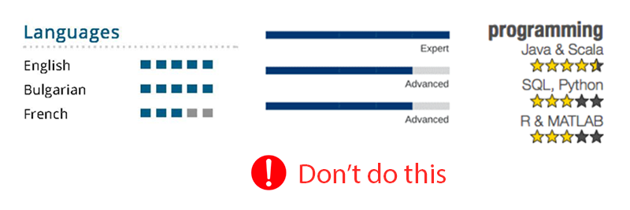

# რეზიუმეს შექმნის წესები (by [Tech Jobs Georgia](https://techjobs.ge))

## სარჩევი

  1. [ენა და ფორმატი](#1-ენა-და-ფორმატი)
  2. [აუცილებელი ინფორმაცია](#2-აუცილებელი-ინფორმაცია)
  3. [არასასურველი ინფორმაცია](#3-არასასურველი-ინფორმაცია)
  4. [გვერდების რაოდენობა](#4-გვერდების-რაოდენობა)
  5. [სურათი](#5-სურათი)
  6. [ვარსკვლავები, პროცენტები, კუბიკები](#6-ვარსკვლავები-პროცენტები-კუბიკები)
  7. [ქრონოლოგია](#7-ქრონოლოგია)
  8. [ჰობი](#8-ჰობი)

## TODO
  1. [სამუშაო გამოციდლება](#სამუშაო-გამოციდლება)
  1. [განათლება](#განათლება)
  1. [უნივერსიტეტი](#უნივერსიტეტი)
  1. [სკოლა](#სკოლა)
  1. [კლიშე ფრაზები](#კლიშე-ფრაზები)
  1. [შაბლონები (LaTex, Google Docs, etc)](#შაბლონები)
  1. [ცვლილებების შეტანა](#ცვლილებების-შეტანა)
  1. ყველა წესს უნდა პატარა განმარტება რატომ არის საჭირო
  1. რატომ არის სასურველი 1 გვერდიანი რეზიუმე?
  1. როგორ უნდა დავაპატარაოთ რეზიუმე ზომაში?
  1. [რეალური მაგალითები](#რეალური-მაგალითები)
  1. გაკეთებული საქმის რიცხვებში შეფასება
  1. [ოლიმპიადები, სერთიფიკატები, ჯილდოები](#ოლიმპიადები-სერთიფიკატები-ჯილდოები)
  1. [არატექნიკური გამოცდილება](#არატექნიკური-გამოცდილება)
  1. კლიშე ფრაზები
  1. ორთოგრაფია, პუნქტუაცია
  1. ტიპოგრაფიული კონსისტენტურობა
  1. უნარები (Languages, Libraries and Frameworks, Paradigms, Platforms, Tools, Databases)
  2. შეუსაბამო გამოცდილება

## 1. ენა და ფორმატი
  - რეზიუმე უნდა იყოს **ინგლისურ** ენაზე **pdf** ფორმატში.

## 2. აუცილებელი ინფორმაცია
  - ✅ **სახელი** და **გვარი**
  - ✅ **მეილი**
  - ✅ **ტელეფონი**
  - ✅ **LinkedIn**-ის მისამართი
  - ✅ **სამუშაო** გამოცდილება (ასეთის არსებობის შემთხვევაში) (TODO: დეტალების ლინკი)
  - ✅ **სასწავლო** გამოცდილება (TODO: დეტალების ლინკი)

## 3. არასასურველი ინფორმაცია
  - ❌ **ეროვნება**
  - ❌ **სქესი**
  - ❌ **დაბადების თარიღი** 
  - ❌ **ოჯახური მდოგმარეობა**
  - ❌ **დეტალური მისამართი**
 
## 4. გვერდების რაოდენობა
  - 🟢 **1 გვერდი არის რეზიუმეს სასურველი ზომა**
  - 🟡 2 გვერდი მრავალწლიანი გამოცდილების შემთხვევაში მისაღებია
  - 🤔 3 გვერდი მისაღებია მხოლოდ გამონაკლის შემთხვევებში
  - 🔴 **4 გვერდი ან მეტი არ მიიღება**

## 5. სურათი
  - რეზიუმეში **სურათი რეკომენდირებული არ არის**
  - უმჯობესია სურათი LinkedIn-ის პროფილზე დააყენოთ
  
## 6. ვარსკვლავები, პროცენტები, კუბიკები
  - ვარსკვლავები, პროცენტები და კუბიკები **არ გამოიყენოთ** ცოდნის და გამოცდილების შესაფასებლად.
  

## 7. ქრონოლოგია
  - რეკომენდირებულია დასაწყისში იყოს **ბოლო მოვლენები**. ჯერ აქტიური სამსახური, შემდეგ წინები, შემდეგ განათლება...
  - ქრონოლოგიის შედგენისას შეეცადეთ მნიშვნელოვანი ფაქტები იყოს ნაკლებად მნიშვნელოვანზე ზევით.
  - იდეალურ შემთხვევაში რეკრუტერმა ნახევარ გვერდს რომ გადაავლოს თვალი, სასურველი ინფორმაციის მაინც უნდა მიიღოს.  

## 8. ჰობი
  - აზრთა სხვადასხვაობაა უნდა იყოს თუ არა მითითებული კანდიდატის ჰობი ან სხვა პირადი ინფორმაცია.
  - ზოგის აზრით ჰობის მითითება არ არის საჭირო, რადგან პროფესიასთან არანაირი კავშირი არ აქვს.
  - ზოგი თვლის, რომ მცირედი ინფორმაცია ადამიანის შესახებ სასარგებლო არის გადაწყვეტილების მიღებისას.
  - ჰობის ჩაწერის შემთხვევაში, რეკომენდირებულია გამოიყენეთ **ცოტა სივრცე და დაწეროთ ბოლოში**.

**[⬆ უკან სარჩევში](#სარჩევი)**
